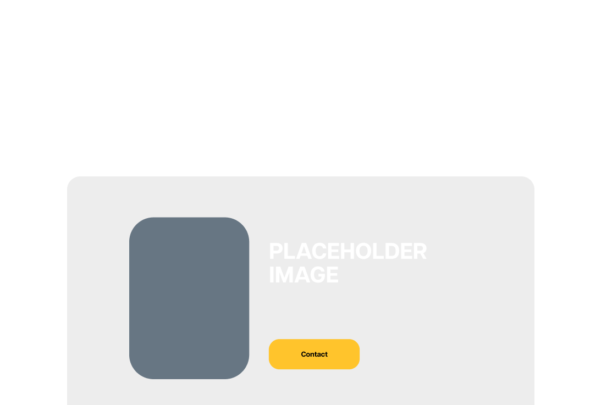
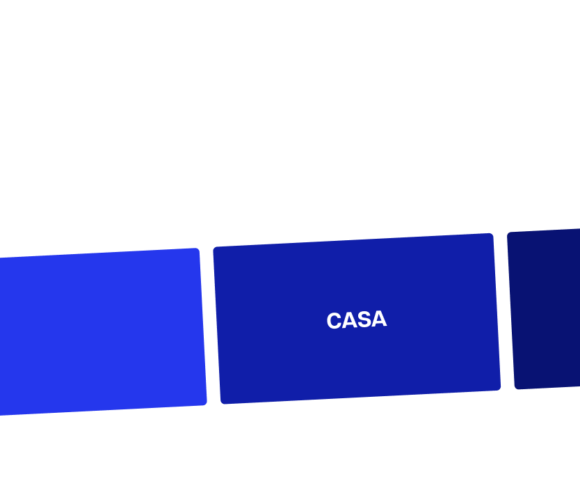
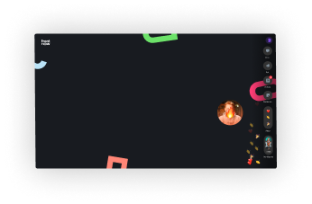

<!DOCTYPE html>
<html>
  <head>
    <meta charset="utf-8" />
    <!--<meta name=description content="This site was generated with Anima. www.animaapp.com"/>-->
    <!-- <link rel="shortcut icon" type=image/png href="https://animaproject.s3.amazonaws.com/home/favicon.png" /> -->
    <meta name="viewport" content="width=1124, maximum-scale=1.0" />
    <link rel="shortcut icon" type="image/png" href="https://animaproject.s3.amazonaws.com/home/favicon.png" />
    <link rel="stylesheet" type="text/css" href="home.css" />
    <link rel="stylesheet" type="text/css" href="styleguide.css" />
    <link rel="stylesheet" type="text/css" href="globals.css" />
  </head>
  <body style="margin: 0; background: #ffffff">
    <input type="hidden" id="anPageName" name="page" value="home" />
    

      

        

          

            

            
            

            

            
Skills

            
Contact

            
Case Study

            <h1 class="name-1">Will Parker</h1>
            
Ux/Ui designer with a focus on Product Management for e-commerce tools

            
            

              

Case Studies

            

          

          
Experience and Tools

          

            

              
              
            

            
            
          

          

            

            
Will Parker - Product Manager

            

              Will Parker is a creative product manager with a solutions focused approach. He brings an intuitive
              understanding of E-commerce to his work.
            

            

            
            
Hi, I’m Will! 👋

            

              I’ve been in the creative industry for 5+ years designing for brands and building crazy experiences.  My
              passions lie in solving problems that are important for the user.   Since my teens, I have been
              building E-commerce stores. My recently however, my focused has shifted from building more stores, to
              creating tool that will help reduce friction in the customer experience.   This is a life long
              passion that I look forward to exploring more as time progresses. Thank you for looking at my portfolio -
              I’m excited to hear from you!
            

            

            

            

            
            
            
          

          

            

              
            

            

              
            

            

              
            

          

        

        

          

            
Soft Skills.

            

              Wills’ diverse experience in acting and sales have equipped him with the skills to speak to people of all
              levels.
            

          

          

            
Analysis.

            

              Being data driven, Will makes calculated decisions based on the numbers.
            

          

          

            
Design.

            

              He has a passion for sleek, intuitive user interfaces that are both beautiful and easy to use.
            

          

        

        

          

Contact

          

            
Deliver differently.

            

              ‘Will has continuously gone above and beyond to deliver the best products for our team.’
            

          

          

            

              

              

              
              
Product Management

              

                Will’s experience in both the freelance and startup worlds have seen him create products that solve
                important problems. His passion for unique E-commerce tools has lead to the fulfilling career he has had
                so far.
              

              
Product Management

              

                Will’s experience in both the freelance and startup worlds have seen him create products that solve
                important problems. His passion for unique E-commerce tools has lead to the fulfilling career he has had
                so far.
              

              
            

            

              

              

              

              

              

            

            

              Let’s connect and chat about what you need.
            

            

              Initial chat and project outline.
            

            

              Delivering a product that you love.
            

            

              Will Parker is a freelancer / entrepreneur at heart. If you’re looking for someone to work as a close
              extension of your business - you’ve come to the right place.
            

          

          

            

            

              

              

                

                
CASA

              

              

                

                
Head Start Homes

              

            

            

              
Past Projects

              

                Will has worked on successful redesigns and built projects from the ground up.  Click on each tile
                to read more.
              

            

            
            

              

              

                

                
CASA

              

              

                

                
Head Start Homes

              

            

            

              
Past Projects

              

                Will has worked on successful redesigns and built projects from the ground up.  Click on each tile
                to read more.
              

            

          

          

            

              
            

            

              
              
Will has been more than an asset.

              

                He turned our site into an embarrassment to the anchor point of our entire business
              

              
Stephen Woodland

              
Head-Start Homes

            

          

          

            

            
See more of Will’s work.

            
            
            
            
            
            
            
Casa

            
AMP 4 Email

            
Head Start Homes

            
Shopify Sites

            
TBA

            
Photography

            
A GenZ first Real Estate App

            

              Frictionless Checkout System for E-commerce brand
            

            

              Building Credibility with Australia’s Largest Companies
            

            
Money Printers

            
Coding Project

            
Personal and Creative Work

            

            

            

            

            

            

            

          

          

            

              

                Contact Will to supercharge your project.
              

              

                He is looking forward to leading your idea to success.
              

              

                

                

Get in Touch

              

            

            
            

          

          

            
Melbourne, Australia 🇦🇺

            

              

                
ABOUT WILL

                
Home

                
Resume

              

              

                
CASE STUDIES

                
Casa

                
Head Start Homes

              

              

                
CONACT

                
will@wpdigital.com.au

                
0466340970

              

            

            

Contact

          

        

      

    

  </body>
</html>
